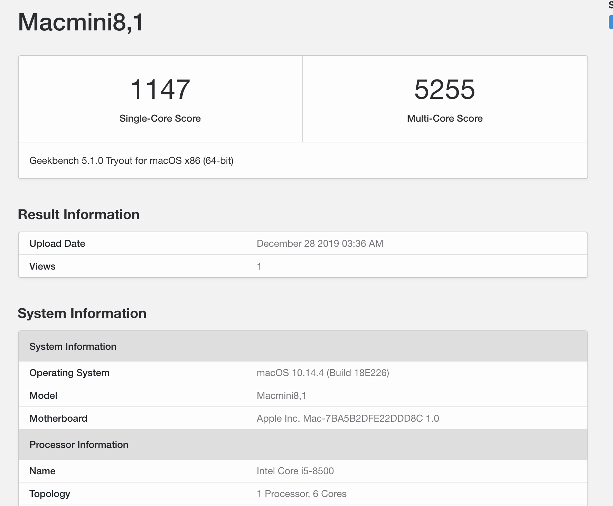

# DeskMini 310 Hackintosh

i5-8500集成了UHD630显卡，支持4K输出，苹果的Mac Mini 2018也是使用的这颗CPU，所以UHD630是免驱的，可以直接使用，不需要`WhateverGreen.kext`注入，但如果是使用双屏就需要特别处理了。

## 配置

|                | 型号                          |
| -------------- | ----------------------------- |
| CPU            | i5-8500                       |
| 主板/机箱/电源 | DeskMini 310                  |
| 内存           | Crucial DDR4 2400 16G x2      |
| SSD            | 三星 860 evo 512G             |
| 无线/蓝牙      | DW1820A(BCM94356) 096JNT      |
| 天线           | NGFF M2无线网卡转接线天线     |
| USB排线        | 双口USB线9孔杜邦USB带耳朵挡板 |
| 显示器         | KOIOS K2718UD                 |

### BIOS设置

我的BIOS版本是P4.2

> Load UEFI Defaults
>   * Advanced
>     - CPU Configuration
>       - CPU C States Support : Enable
>         - CFG LOCK : Disabled
>     * Chipset Configuration
>       * VT-d: Disabled
>       * Onboard HD Audio: Enabled
>     * USB Configuration
>       * XHCI Hand-off: Enabled
>     * Super IO Configuration
>       * Serial Port: Disabled
>   * Security
>    
>     * Secure Boot: Disabled(by default)
>   - Boot
>     * CSM disable
>

## 正常

- 变频 
  
  - 需要使用Intel Power Gadget工具来查看，别的不准确
  
- 声音 
  - DP接口显示器音频正常
  - 机箱3.5mm输出正常
  
- 4K输出
  
  - K2718UD 
  
- 无线
  
  - 1820A(096) 屏蔽5个针角
  
- 蓝牙

- 睡眠

## 截图

  

